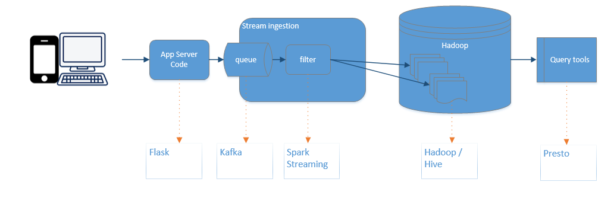
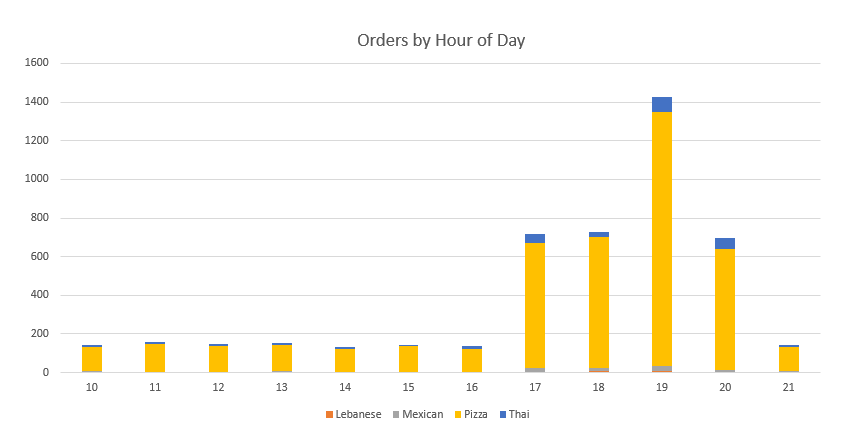
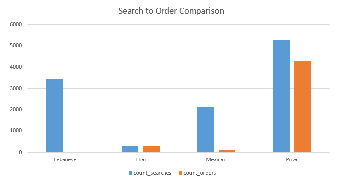

# Restaurant App Analysis Report


Fictional Restaurant Group ‘KGAC’ has a mobile app that allows users to search for menus and order online for delivery. KGAC has hired a team of data scientists to find ways to improve its online ordering service and improve customer loyalty and adoption. With these goals in mind, the data scientist team at KGAC have implemented a data analytics workflow to capture desktop and mobile interactions. The goal is to answer some of the business questions summarized below.

What are the most popular menu items?
What menu items should the restaurants introduce or improve?
How can we improve customer loyalty through targeted promotions and coupons?
How many new registrations are we getting?

## Data Pipeline and End-to-End Flow:

Here is overall flow of our data pipeline



We have events designed to query for increased customer loyalty. The data is synthesized using Bench and a Flask web app. We have generated 42,452 random events for online menu ordering. The data is streamed using Kafka and Spark Streaming. Finally, the data is queried in Presto.

Here are list of events that are captured:

| Event Name                |
|---------------------------|
|New user registration      |
|Create Profile             |
|Customer Login             |
|Customer searches menu     | 
|Customer orders from menu  |
|Customer posts review      |
|Customer posts star rating |

## Tables and structure
There are two tables with similar structures:

- *menu_app_events* contains general events relating to logging into the app, creating profiles, searching and posting reviews:

`describe menu_app_events;`  

  
Column          |   Type    | Comment 
----------------|-----------|---------
raw_event       | varchar   |         
kafka_timestamp | timestamp |         
accept          | varchar   |         
host            | varchar   |         
user_agent      | varchar   |         
description     | varchar   |         
event_timestamp | timestamp |         
event_type      | varchar   |         
uid             | varchar   |       

- *menu_app_orders* contains events relating to orders people have made

`describe menu_app_orders;`  

Column           |   Type    | Comment 
-----------------|-----------|---------
 raw_event       | varchar   |         
 kafka_timestamp | timestamp |         
 accept          | varchar   |         
 host            | varchar   |         
 user_agent      | varchar   |         
 coupon          | varchar   |         
 description     | varchar   |         
 event_timestamp | timestamp |         
 event_type      | varchar   |         
 price           | integer   |         
 uid             | varchar   |         

The tables share some common fields:  

#### General fields related to the message and not used for analysis:
- raw_event: the entire event from the message broker (kafka)
- kafka_timestamp: the timestamp of when the message was produced in kafka
- accept: the accept field from kafka, always **/**
- host: the host of the requestor (a constant of *user1.comcast.com* in this case) 
- user_agent: the agent that made the request, this is always *ApacheBench/2.3* for this test but would be useful in real life to check what user_agents were making the call

#### Common fields between events and orders
- event_timestamp: the timestamp for the event as generated by the api (not the kafka timestamp)
- event_type: This is the kind of event that is being logged, e.g. post_rating or order_food
- description: The _value_ related to the event_type _key_, e.g. '5' for post_rating or 'Lebanese' for order food

#### Fields specific to orders
The orders table has two specific fields that are only applicable when ordering food.  
- coupon: Did the customer use a coupon to order food
- price: The price of the order

## Exploratory analysis of event data  
What event types in the events table?

`select event_type, count(*) as cnt from menu_app_events group by event_type;`  
  
event_type      |  cnt  
----------------|-------
 menu_search    | 11117 
 post_review    |  2424 
 post_rating    |  8700 
 login          | 14118 
 new_user       |  1000 
 create_profile |   367 

```
  select event_type, description, count(*) as cnt 
  from menu_app_events 
  where event_type in ('menu_search', 'post_review', 'post_rating')
  group by event_type, description 
  order by event_type, description;
```

 event_type  |      description      | cnt  
-------------|-----------------------|------
 menu_search | Lebanese              | 3457 
 menu_search | Mexican               | 2125 
 menu_search | Pizza                 | 5249 
 menu_search | Thai                  |  286 
 post_rating | 1                     | 1326 
 post_rating | 2                     |   12 
 post_rating | 3                     | 1021 
 post_rating | 4                     | 6243 
 post_rating | 5                     |   98 
 post_review | The food was amazing! | 1098 
 post_review | Yuck-o-rama!!!        | 1326


## Exploratory analysis of order data  
What event types in the orders table?

`select event_type, count(*) as cnt from menu_app_orders group by event_type;`  
  
event_type  | cnt  
------------|------
 order_food | 4726 

# User Adoption Analysis
#### 1. What foods have the most coupons been used for?
```
select description, coupon, count(*) countForCombo
from menu_app_orders
group by coupon, description
order by description asc, coupon desc;
```

 description | coupon | countForCombo 
-------------|--------|---------------
 Lebanese    | Yes    |             5 
 Lebanese    | No     |            24 
 Mexican     | Yes    |            24 
 Mexican     | No     |            80 
 Pizza       | Yes    |          1054 
 Pizza       | No     |          3257 
 Thai        | Yes    |            80 
 Thai        | No     |           202 
   
Pizza is the most popular food ordered by a large margin. Lebanese food has the fewest number of orders and the lowest ratio of coupon orders (17.2%)
  
####  2. What time are certain foods ordered?
```
select description, HOUR(event_timestamp AT TIME ZONE 'UTC') hour, count(*) countForCombo
from menu_app_orders
group by description, HOUR(event_timestamp AT TIME ZONE 'UTC')
order by description, HOUR(event_timestamp AT TIME ZONE 'UTC');
```

 description | hour | countForCombo 
-------------|------|---------------
 Lebanese    |   10 |             2 
 Lebanese    |   13 |             3 
 Lebanese    |   14 |             2 
 Lebanese    |   17 |             5 
 Lebanese    |   18 |             6 
 Lebanese    |   19 |             7 
 Lebanese    |   20 |             4 
 Mexican     |   10 |             5 
 Mexican     |   11 |             4 
 Mexican     |   12 |             4 
 Mexican     |   13 |             4 
 Mexican     |   14 |             2 
 Mexican     |   15 |             4 
 Mexican     |   16 |             2 
 Mexican     |   17 |            19 
 Mexican     |   18 |            16 
 Mexican     |   19 |            29 
 Mexican     |   20 |             9 
 Mexican     |   21 |             6 
 Pizza       |   10 |           127 
 Pizza       |   11 |           144 
 Pizza       |   12 |           136 
 Pizza       |   13 |           137 
 Pizza       |   14 |           119 
 Pizza       |   15 |           135 
 Pizza       |   16 |           122 
 Pizza       |   17 |           647 
 Pizza       |   18 |           678 
 Pizza       |   19 |          1311 
 Pizza       |   20 |           627 
 Pizza       |   21 |           128 
 Thai        |   10 |            10 
 Thai        |   11 |            12 
 Thai        |   12 |             7 
 Thai        |   13 |             8 
 Thai        |   14 |             9 
 Thai        |   15 |             6 
 Thai        |   16 |            11 
 Thai        |   17 |            46 
 Thai        |   18 |            30 
 Thai        |   19 |            81 
 Thai        |   20 |            55 
 Thai        |   21 |             7 

Most food is ordered at 7pm, with orders increasing to this time and decreasing from this time.



####  3. What time people are logging in

```
select event_type, HOUR(event_timestamp AT TIME ZONE 'UTC') hour, count(*) countForCombo 
from menu_app_events 
where event_type = 'login' 
group by event_type, HOUR(event_timestamp AT TIME ZONE 'UTC') 
order by HOUR(event_timestamp AT TIME ZONE 'UTC');
```

 event_type | hour | countForCombo 
------------|------|---------------
 login      |   10 |           423 
 login      |   11 |           433 
 login      |   12 |           476 
 login      |   13 |           391 
 login      |   14 |           437 
 login      |   15 |           455 
 login      |   16 |           428 
 login      |   17 |          2057 
 login      |   18 |          2138 
 login      |   19 |          4343 
 login      |   20 |          2105 
 login      |   21 |           432 
 
There is an opportunity to increase ad fees in the evening and offer coupons outside of these hours, since we know this is when most traffic is coming in.
 
####  4. What time are most food orders put in?

```
select event_type, HOUR(event_timestamp AT TIME ZONE 'UTC') hour, count(*) countForCombo 
from menu_app_orders 
group by event_type, HOUR(event_timestamp AT TIME ZONE 'UTC') 
order by HOUR(event_timestamp AT TIME ZONE 'UTC');
```

event_type  | hour | countForCombo 
------------|------|---------------
 order_food |   10 |           144 
 order_food |   11 |           160 
 order_food |   12 |           147 
 order_food |   13 |           152 
 order_food |   14 |           132 
 order_food |   15 |           145 
 order_food |   16 |           135 
 order_food |   17 |           717 
 order_food |   18 |           730 
 order_food |   19 |          1428 
 order_food |   20 |           695 
 order_food |   21 |           141 
 
- There is a correlation between login times and order times, whereby most activity is happening at 7pm.
- Make sure we have couriers available at these hours, we should be staffing accordingly. 
- 7pm is the most popular time to order food, we could increase coupon offereings to other times to spread the work load and increase usage.


####  5. What are the average user sign ups/month?
```
select event_type, MONTH(event_timestamp AT TIME ZONE 'UTC') as Month, count(*) countForCombo 
from menu_app_events where event_type = 'create_profile' 
group by event_type, MONTH(event_timestamp AT TIME ZONE 'UTC') 
order by MONTH(event_timestamp AT TIME ZONE 'UTC') asc;
```

   event_type   | Month | countForCombo 
----------------|-------|---------------
 create_profile |     1 |            69 
 create_profile |     2 |            76 
 create_profile |     3 |            59 
 create_profile |     4 |            52 
 create_profile |     5 |            46 
 create_profile |     6 |            64 
 
- Our monthly user sign are relatively consistent with dips in April and May and an increase in February
- Offering seasonal discounts or campaigns could improve adoption

####  6. Order conversion rate.
```
select menu_search, count_searches, count_orders, round(cast(count_orders as double) / cast(count_searches as double),3) as order_ratio from 
  (select description as menu_search, count(uid) as count_searches from menu_app_events where event_type = 'menu_search' group by description) as foo 
join 
  (select description as menu_order, count(uid) as count_orders from menu_app_orders group by description) as bar
on foo.menu_search = bar.menu_order;
```

 menu_search | count_searches | count_orders | order_ratio 
-------------|----------------|--------------|-------------
 Lebanese    |           3457 |           29 |       0.008 
 Thai        |            286 |          282 |       0.986 
 Mexican     |           2125 |          104 |       0.049 
 Pizza       |           5249 |         4311 |       0.821 
 
- This shows the ratio between menu searches and orders made by a specific menu
- Lebanese food has a high number of searches with a tiny conversion rate. We need to investigate this further and offer more coupons for Lebanese food or consider improving the menu.



####  7. Ratings Review
```
select description, count(*) as rating from menu_app_events where event_type = 'post_rating' group by description;
```

 description | rating 
-------------|--------
 5           |     98 
 4           |   6243 
 3           |   1021 
 2           |     12 
 1           |   1326 
 
- There are a good number of 4 star reviews, but a concerning number of 1 star reviews
- We need to look at review sentiment, topic analysis and reasons why there are so many 1 star reviews
- We need to investigate ways to push 4 star to 5 star reviews

####  8. Top Reviewers
```
select uid, count(*) as rating 
from menu_app_events 
where event_type = 'post_rating' group by uid
order by count(*) desc  limit 5;
```

  uid   | rating 
--------|--------
 A00748 |     17 
 A00798 |     17 
 A00135 |     17 
 A00520 |     17 
 A00327 |     17 

## Recommendations

### Converting Menu Searches to Food Orders
We are currently seeing an average of 0.42 orders for every 1 menu search by unique customer. We can treat this as our benchmark moving forward, and our goal should be to increase this each month. While total orders is of course what drivers our business, we need to experiment with making incremental changes to our app to improve our turnover rate for customers who search the menu. If customers are opening our app, searching a menu, and then closing it and not making an order, we need to know why and we need to take steps towards addressing it. One idea is to send a survey to our customers asking them what their thoughts are on our app or our available menus to see how we can improve. Customers’ feedback from these surveys should help convert these menu searches into actual sales.

### Ad Space during Peak Hours
Observing the customer log-in times, we can see that the majority of log ins happen between 6:00 pm and 8:00 pm PST. This is most likely when customers are home after work and want to order dinner in. As this signifies a key window how high customer traffic, it would behoove us to charge higher fees for ad space during these peak hours. We can push this as our promotion “golden hours”, guaranteeing our commercial partners the highest customer exposure for an extra fee.

### Coupons
We see that coupons customers only use coupons on about 23% of total orders. And while an overwhelming number of these coupon uses were on Pizza, this is less significant when you look at the fact that Pizza makes up the majority of food orders. What does stand out is that when customers order Thai food, they are using coupons 28% of the time. We should be looking at the deals we are offering for Thai food and try to mimic them for our other cuisines to increase sales. Additionally, Lebanese food is the least ordered cuisine on our service, and has the lowest coupon rate at 17% indicating that the menu offering for Lebanese food is not good enough.

### Food Order Times
71% of our orders come between 6:00 pm – 8:00 pm PST. On our end, we need to make sure that all parties are ready during this time and have the necessary resources. Thus, we should be sure that the chefs making the food are aware of this and have enough staff during these hours. We should also make sure that we have an ample number of couriers available to deliver during these high demand hours. Finally, we should also make sure that we have IT staff on hand to address any technical difficulties with our app. These are the prime hours for our business and how we deliver will reflect in our customers’ experience and, in turn, the ratings we get. Thus, we cannot afford to be shorthanded in any of our departments during this time

### Review status
The high number of 1 star and low number of 5 star reviews is concerning. We need to do further investigation into why this is occurring through analysis of related orders and app usage. This is at the heart of user adoption and really needs addressing.
